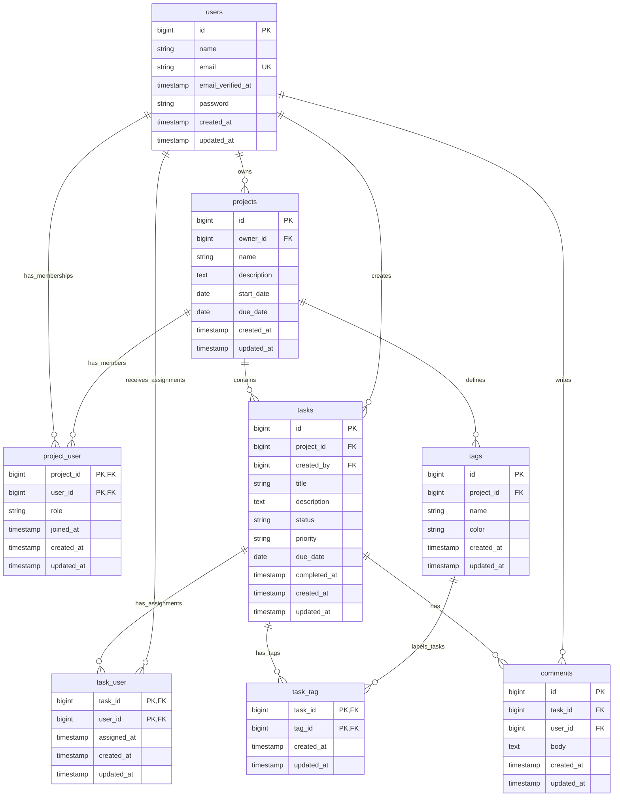

# TaskFlow Entity-Relationship Diagram

The proposed schema keeps membership, assignment, and tagging relationships explicit through pivot tables. Project ownership is separate from project membership; an owner should also receive an `owner` membership row when a project is created.

## Constraints and cardinalities

- A user can own zero or many projects; each project has exactly one owner through `projects.owner_id`.
- Users and projects have a many-to-many membership relationship through `project_user`. Each pivot row belongs to exactly one user and one project and is unique by `(project_id, user_id)`.
- A project can contain zero or many tasks; each task belongs to exactly one project.
- A user can create zero or many tasks; each task records exactly one creator through `tasks.created_by`.
- Users and tasks have a many-to-many assignment relationship through `task_user`, unique by `(task_id, user_id)`.
- A project can define zero or many tags; each tag belongs to exactly one project. Tag names should be unique within a project.
- Tasks and tags have a many-to-many relationship through `task_tag`, unique by `(task_id, tag_id)`. Application validation must ensure both belong to the same project.
- A task can have zero or many comments; each comment belongs to exactly one task and one authoring user.
